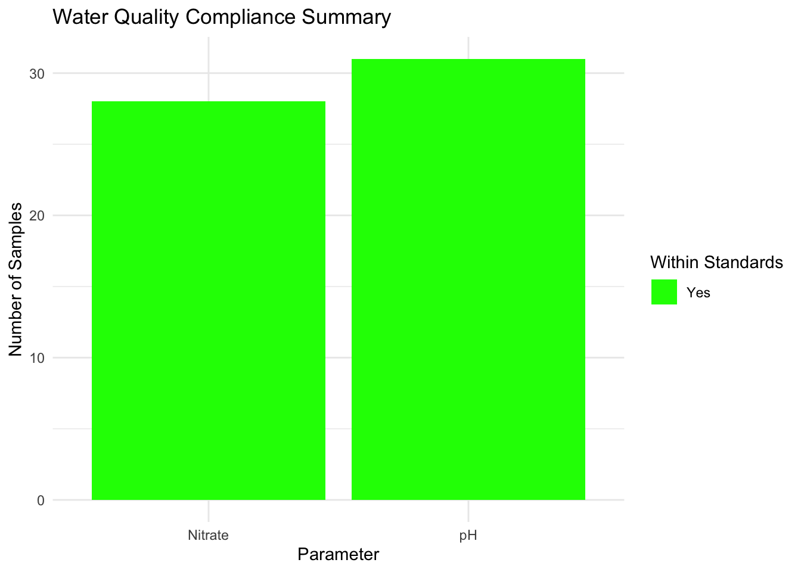

# Water Quality Laboratory Analysis and Reporting Dataset – Malawi (2017–2019)

[](https://github.com/openwashdata/boreholelabdata/actions/workflows/R-CMD-check.yaml)
[](https://zenodo.org/doi/10.5281/zenodo.17433461)

The dataset captures water quality test results from various water
points across Malawi, collected between 2017 and 2019 using the mWater
platform. It includes metadata on sample collection events, site
geolocation, submission and approval timelines, and laboratory analysis
outcomes. The data reflects structured workflows for monitoring water
safety, supporting both operational decision-making and long-term water
quality management.

**Intended Users and Applications**

1.  **Water Utilities and Service Providers:** To monitor the quality of
    water from different sources, schedule maintenance or treatment, and
    improve service delivery.

2.  **Environmental Health Officers and District Councils:** To identify
    unsafe water points, plan targeted inspections, and coordinate local
    water safety interventions.

3.  **WASH Program Implementers:** To assess baseline water quality
    conditions, prioritize high-risk areas, and track the impact of
    water safety programs.

4.  **Academic Institutions and Research Bodies:** To analyze regional
    and seasonal trends in water quality and contribute to the evidence
    base for safe water practices in low-resource settings.

5.  **Government Ministries**: To inform national water safety planning,
    update regulations, and allocate resources based on real-world data.

6.  **Development Agencies and International Donors**: To evaluate
    program outcomes, justify investments, and align support with areas
    of greatest water quality need.

## Installation

You can install the development version of boreholelabdata from
[GitHub](https://github.com/) with:

``` r

# install.packages("devtools")
devtools::install_github("openwashdata/boreholelabdata")
```

``` r

## Run the following code in console if you don't have the packages
## install.packages(c("dplyr", "knitr", "readr", "stringr", "gt", "kableExtra"))
library(dplyr)
library(knitr)
library(readr)
library(stringr)
library(gt)
library(kableExtra)
```

Alternatively, you can download the individual datasets as a CSV or XLSX
file from the table below.

1.  Click Download CSV. A window opens that displays the CSV in your
    browser.
2.  Right-click anywhere inside the window and select “Save Page As…”.
3.  Save the file in a folder of your choice.

| dataset | CSV | XLSX |
|:---|:---|:---|
| boreholelabdata | [Download CSV](https://github.com/openwashdata/boreholelabdata/raw/main/inst/extdata/boreholelabdata.csv) | [Download XLSX](https://github.com/openwashdata/boreholelabdata/raw/main/inst/extdata/boreholelabdata.xlsx) |

## Data

The package provides access to water quality test results from various
water points across Malawi, collected between 2017 and 2019 using the
mWater platform

``` r

library(boreholelabdata)
```

### boreholelabdata

The dataset `boreholelabdata` contains 32 observations and 53 variables

``` r

boreholelabdata |> 
  head(3) |> 
  gt::gt() |>
  gt::as_raw_html()
```

| waterpoint_name | waterpoint_type | latitude | longitude | date_sample_collected | date_sample_analyzed | date_results_received | lab_sample_no | ph_value | ph_within_mw_standards | conductivity | conductivity_within_mw_standards | tds_mg_l | tds_within_standards | carbonate_mg_l | carbonate_within_standards | bicarbonate_mg_l | bicarbonate_within_standards | chloride_mg_l | chloride_within_standards | sulphate_mg_l | sulphate_within_standards | nitrate_mg_l | nitrate_within_standards | fluoride_mg_l | fluoride_within_standards | sodium_mg_l | sodium_within_standards | potassium_mg_l | potassium_within_standards | calcium_mg_l | calcium_within_standards | magnesium_mg_l | magnesium_within_standards | iron_mg_l | iron_within_standards | manganese_mg_l | manganese_within_standards | hardness_mg_l | hardness_within_standards | alkalinity_mg_l | alkalinity_within_standards | arsenic | arsenic_within_standards | turbidity_ntu | turbidity_within_standards | suspended_solids | suspended_within_standards | faecal_coli_count | faecal_coli_within_standards | faecal_strep_count | faecal_strep_within_standards | comments |
|:---|:---|---:|---:|---:|---:|---:|---:|---:|:---|---:|:---|---:|:---|---:|:---|---:|:---|---:|:---|---:|:---|---:|:---|---:|:--:|---:|:---|---:|:---|---:|:---|---:|:---|---:|:---|---:|:---|---:|:---|---:|:---|---:|:---|---:|:---|---:|:--:|---:|:---|---:|:---|:---|
| Khaoleya borehole 4 | Borehole or tubewell | -15.92188 | 35.31536 | 2/12/2019 | NA | 3/13/2019 | 19-072 | 6.52 | Yes | 658.00 | Yes | 330.00 | Yes | 0 | Yes | 241.0 | Yes | 79.0 | Yes | 5.1 | Yes | 0.800 | Yes | NA | NA | 40.0 | Yes | 5.8 | Yes | 57.6 | Yes | 16.5 | Yes | 0.010 | Yes | NA | NA | 212 | Yes | 198 | Yes | NA | NA | 0.1 | Yes | NA | NA | 0 | Yes | 0 | Yes | Water quality within Government standards. |
| Chapenda village borehole | Borehole or tubewell | -15.98541 | 34.47857 | 12/11/2017 | NA | 2/5/2018 | NA | 7.20 | Yes | 1350.00 | NA | 810.00 | NA | 0 | NA | 622.0 | NA | 82.7 | NA | 38.8 | NA | 0.986 | NA | -9 | NA | 63.0 | NA | 2.8 | NA | 124.0 | NA | 52.6 | NA | 0.041 | NA | NA | NA | 526 | NA | 510 | NA | NA | NA | 0.9 | NA | 0.1 | NA | NA | NA | NA | NA | NA |
| Kunthete 2 | Borehole or tubewell | -14.09457 | 34.08384 | 7/2/2019 | 7/3/2019 | 7/3/2019 | NA | 6.40 | Yes | 0.44 | Yes | 0.27 | Yes | 0 | N/A | 217.2 | N/A | 16.3 | Yes | 66.5 | Yes | 0.060 | Yes | NA | NA | 19.8 | Yes | 1.0 | N/A | 57.6 | Yes | 54.4 | Yes | NA | NA | NA | NA | NA | NA | NA | NA | 0 | Yes | NA | NA | NA | NA | NA | NA | NA | NA | Ionic Balance error using milliequivalence = 22.86%. |

For an overview of the variable names, see the following table.

| variable_name | variable_type | description |
|:---|:---|:---|
| waterpoint_name | character | Name of the water point site |
| waterpoint_type | character | category of the water point (e.g., borehole, well, spring) |
| latitude | numeric | Geographic latitude coordinate of the water point |
| longitude | numeric | Geographic longitude coordinate of the water point |
| date_sample_collected | character | Date when the water sample was physically collected from the site |
| date_sample_analyzed | character | Date when the collected sample was analyzed in the laboratory |
| date_results_received | character | Date when the lab results were received or recorded |
| lab_sample_no | character | Unique laboratory identification number assigned to the sample |
| ph_value | numeric | pH value of the water sample |
| ph_within_mw_standards | character | pH value falls within Malawis water quality standards (Yes/No) |
| conductivity | numeric | Measures electrical conductivity of water, indicating ion concentration (µS/cm at 25C) |
| conductivity_within_mw_standards | character | conductivity is within Malawis acceptable standards (Yes/No) |
| tds_mg_l | numeric | Concentration of total dissolved solids in mg per liter |
| tds_within_standards | character | total dissolved solids fall within Malawis standards (Yes/No) |
| carbonate_mg_l | numeric | Concentration of carbonate ions in mg per liter |
| carbonate_within_standards | character | carbonate levels meet Malawis water standards (Yes/No) |
| bicarbonate_mg_l | numeric | Concentration of bicarbonate ions in mg per liter |
| bicarbonate_within_standards | character | bicarbonate levels meet Malawis water standards (Yes/No) |
| chloride_mg_l | numeric | Concentration of chloride ions in mg per liter |
| chloride_within_standards | character | chloride levels are within Malawis acceptable limits (Yes/No) |
| sulphate_mg_l | numeric | Concentration of sulphate ions in mg per liter |
| sulphate_within_standards | character | sulphate levels are within Malawis standards (Yes/No) |
| nitrate_mg_l | numeric | Concentration of nitrate ions in mg per liter |
| nitrate_within_standards | character | nitrate levels comply with Malawis standards (Yes/No) |
| fluoride_mg_l | numeric | Concentration of fluoride ions in mg per liter |
| fluoride_within_standards | logical | fluoride levels meet Malawis water quality standards (Yes/No) |
| sodium_mg_l | numeric | Concentration of sodium ions in mg per liter |
| sodium_within_standards | character | sodium concentration is within Malawis standards (Yes/No) |
| potassium_mg_l | numeric | Concentration of potassium ions in mg per liter |
| potassium_within_standards | character | potassium levels comply with Malawis water standards (Yes/No) |
| calcium_mg_l | numeric | Concentration of calcium ions in mg per liter |
| calcium_within_standards | character | calcium levels fall within Malawis acceptable standards (Yes/No) |
| magnesium_mg_l | numeric | Concentration of magnesium ions in mg per liter |
| magnesium_within_standards | character | magnesium levels comply with Malawis standards (Yes/No) |
| iron_mg_l | numeric | Concentration of iron in mg per liter |
| iron_within_standards | character | iron concentration is within Malawis water quality limits (Yes/No) |
| manganese_mg_l | numeric | Concentration of manganese in mg per liter |
| manganese_within_standards | character | manganese levels meet Malawis water standards (Yes/No) |
| hardness_mg_l | numeric | Total hardness of water measured as mg/l of calcium carbonate |
| hardness_within_standards | character | total hardness is within Malawis acceptable limits (Yes/No) |
| alkalinity_mg_l | numeric | Total alkalinity of water measured as mg/l of calcium carbonate |
| alkalinity_within_standards | character | alkalinity levels are within Malawis standards (Yes/No) |
| arsenic | numeric | Concentration of arsenic in water |
| arsenic_within_standards | character | arsenic levels comply with Malawis water quality standards (Yes/No) |
| turbidity_ntu | numeric | Measure of water turbidity in Nephelometric Turbidity Units (NTU) |
| turbidity_within_standards | character | turbidity is within Malawis acceptable water quality limits (Yes/No) |
| suspended_solids | numeric | Concentration of suspended solids in water (mg/l) |
| suspended_within_standards | logical | suspended solids levels meet Malawis standards (Yes/No) |
| faecal_coli_count | numeric | Count of fecal coliform bacteria per 100 ml of water |
| faecal_coli_within_standards | character | fecal coliform counts meet Malawis water quality standards (Yes/No) |
| faecal_strep_count | numeric | Count of fecal streptococci bacteria per 100 ml of water |
| faecal_strep_within_standards | character | fecal streptococci counts meet Malawis water standards (Yes/No) |
| comments | character | Additional remarks or observations related to the sample or site |

## Example Visualization

``` r

library(boreholelabdata)
# Visualization 1: Water Quality Compliance Summary
# Purpose: Display number of samples that meet or exceed Malawian standards per parameter
# Load required libraries
library(dplyr)
library(tidyr)
library(ggplot2)

# Select relevant compliance columns and reshape to long format
compliance_long <- boreholelabdata %>%
  select(fluoride_within_standards,
         nitrate_within_standards,
         ph_within_mw_standards) %>%
  pivot_longer(cols = everything(),
               names_to = "parameter",
               values_to = "compliance") %>%
  filter(!is.na(compliance)) %>%
  mutate(parameter = case_when(
    parameter == "fluoride_within_standards" ~ "Fluoride",
    parameter == "nitrate_within_standards" ~ "Nitrate",
    parameter == "ph_within_mw_standards" ~ "pH",
    TRUE ~ parameter
  ))

# Count compliance status by parameter
compliance_summary <- compliance_long %>%
  group_by(parameter, compliance) %>%
  summarise(count = n(), .groups = "drop")

# Plot stacked bar chart
ggplot(compliance_summary, aes(x = parameter, y = count, fill = compliance)) +
  geom_bar(stat = "identity") +
  scale_fill_manual(values = c("Yes" = "green", "No" = "red")) +
  labs(
    title = "Water Quality Compliance Summary",
    x = "Parameter",
    y = "Number of Samples",
    fill = "Within Standards"
  ) +
  theme_minimal()
```



## License

Data are available as
[CC-BY](https://github.com/openwashdata/%7B%7B%7Bpackagename%7D%7D%7D/blob/main/LICENSE.md).

## Citation

Please cite this package using:

``` r

citation("boreholelabdata")
#> To cite package 'boreholelabdata' in publications use:
#> 
#>   Mhango E, Paterson F, Rattray J (2026). "boreholelabdata: Borehole
#>   Water Quality Laboratory Results, Malawi 2017 to 2019."
#>   doi:10.5281/zenodo.17433461
#>   <https://doi.org/10.5281/zenodo.17433461>.
#>   <https://github.com/openwashdata/boreholelabdata>.
#> 
#> A BibTeX entry for LaTeX users is
#> 
#>   @Misc{mhango_etall:2026,
#>     title = {boreholelabdata: Borehole Water Quality Laboratory Results, Malawi 2017 to 2019},
#>     author = {Emmanuel Mhango and Finlay Paterson and Jamie Rattray},
#>     year = {2026},
#>     doi = {10.5281/zenodo.17433461},
#>     url = {https://github.com/openwashdata/boreholelabdata},
#>     abstract = {This dataset contains comprehensive records of water quality test results collected from various water points across Malawi between 2017 and 2019.},
#>     keywords = {open data,washdata,water quality,groundwater,boreholes,Malawi,wash,water-quality},
#>     version = {1.0.1},
#>   }
```
